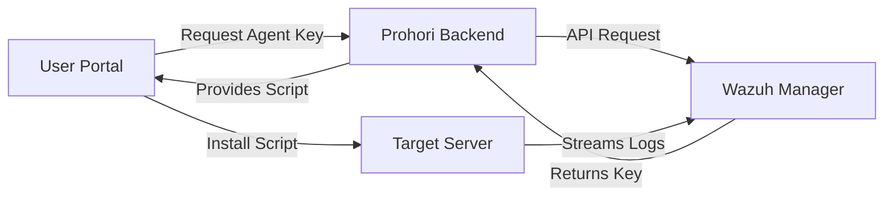
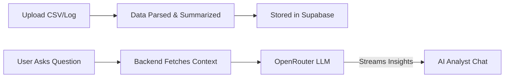

<div align="center">

# 🛡️ PROHORI (প্রহরী)
### Next-Generation AI-Powered Security & Compliance Platform

[](https://nextjs.org/)
[](https://supabase.com/)
[](https://tailwindcss.com/)
[](https://wazuh.com/)

<br/>


<br/>
<br/>

*PROHORI simplifies the tedious, manual process of security analysis and compliance reporting. By combining real-time log ingestion via Wazuh and offline log parsing with advanced AI models, PROHORI reduces analysis time from weeks to minutes.*

</div>

---

## ✨ Key Features

<details>
<summary><b>🤖 AI Security Analyst</b></summary>
Chat with an intelligent security analyst powered by OpenRouter LLMs. Ask questions about your logs or server activity and get human-readable, actionable security insights instantly.
</details>

<details>
<summary><b>📡 Wazuh Agent Management</b></summary>
Deploy endpoint agents directly from the dashboard. Prohori integrates securely with your Wazuh Manager to automatically collect server logs, monitor file integrity, and detect vulnerabilities.
</details>

<details>
<summary><b>📄 Multi-format Log Parsing</b></summary>
Upload offline data effortlessly. Prohori supports native parsing of raw text logs, CSV, and Excel files directly in the browser and server.
</details>

<details>
<summary><b>📑 Automated Compliance Reports</b></summary>
Generate beautifully branded, watermark-stamped security and compliance reports with a single click. Available for download in HTML, PDF, and DOCX formats.
</details>

<details>
<summary><b>🏢 Multi-Tenant Architecture</b></summary>
Built with enterprise-grade security using Supabase Row Level Security (RLS). Every company’s data, users, and audit logs are strictly isolated and secure.
</details>


---

## 🏗️ Design Structure

PROHORI is designed with a modern, scalable architecture prioritizing both user experience and data security:

* **Frontend:** Built on **Next.js 14 App Router** utilizing React Server Components. The UI is crafted with **Tailwind CSS**, **Shadcn UI**, and features smooth animations via **Framer Motion**.
* **Backend:** Next.js Server Actions and API routes handle all business logic, ensuring API keys and sensitive operations remain secure.
* **Database & Auth:** Powered by **Supabase**. It handles secure user authentication and utilizes strict PostgreSQL RLS policies for tenant data isolation.
* **Integrations:**
  * **Wazuh API:** Handles real-time endpoint security monitoring (configured to gracefully handle self-signed certificates).
  * **OpenRouter:** Drives the AI Analyst feature by interpreting pre-summarized log data to optimize token usage.

---

## 🔄 Core Workflow

### 1. Agent Deployment & Data Collection


### 2. AI Log Analysis


---

## 🚀 Getting Started

Follow these steps to run PROHORI locally.

### Prerequisites
- Node.js (v18+)
- A Supabase Project
- OpenRouter API Key
- A Wazuh Manager instance (optional, for endpoint features)

### Installation

1. **Clone the repository:**
   ```bash
   git clone <repository-url>
   cd prohori
   ```

2. **Install dependencies:**
   ```bash
   npm install
   ```

3. **Environment Configuration:**
   Copy the example environment variables file:
   ```bash
   cp .env.local.example .env.local
   ```
   *Populate `.env.local` with your Supabase keys, OpenRouter key, and Wazuh credentials.*

4. **Run the Development Server:**
   ```bash
   npm run dev
   ```
   Open [http://localhost:3000](http://localhost:3000) to view the application.

5. **Build for Production:**
   ```bash
   npm run build
   npm start
   ```

---
<div align="center">
  <p>Built with ❤️ for Security Professionals.</p>
</div>
